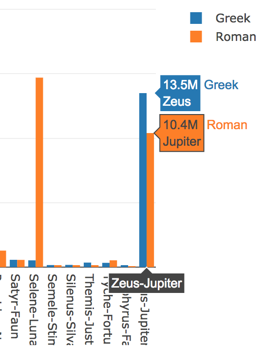

# Greek vs. Roman Mythology

In this activity, you will compare search results between Greek and Roman mythology to see which god is the most popular god.

## Instructions

Ancient Roman gods were often counterparts to or imports of Greek gods. For example, the Greek god Zeus became the Roman god Jupiter via an etymological transformation from Zeus to Zeus Pater ("Father Zeus") to Jupiter. (Classical Latin lacked a "J" consonant.) The question is, in today's world, are these gods better known by their Roman names or Greek names?

Your task is to plot the number of search results, of both Roman and Greek names, returned for each god in order to answer this question.

* Begin by examining the data in `data.js`. Note the names of properties in each data object.

* To accomplish this task, you will need to create two traces, one for Roman gods, and another for Greek gods.

* To define the data for each plot point in a trace, use a `for` loop on the dataset. For each trace:

  * For the x-axis, provide an array of the paired string of Greek and Roman god names, e.g., Amphitrite-Salacia.

  * For the y-axis, provide an array of search results for Greek and Roman god names in their separate traces.

------

© 2021 Trilogy Education Services, a 2U, Inc. brand. All Rights Reserved.
