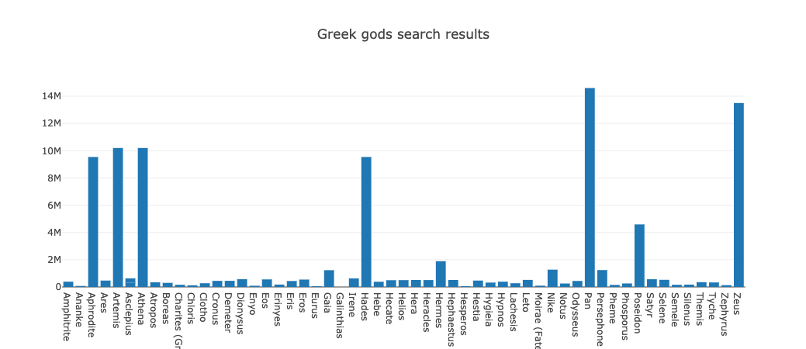

# Mapping with Plotly

In this activity, you will create an array of Greek god search results using the `map` function with the [data.js](Unsolved/data.js) dataset.

## Instructions

1. Create an array of Greek god names from the [data.js](Unsolved/data.js) dataset.

2. Create an array of Greek god search results from the [data.js](Unsolved/data.js) dataset.

3. Create a Plotly bar chart with names on the x axis and search results on the y axis, for example: 

**Hint:** Open the console to see the dataset stored in the variable `data`.

------

© 2021 Trilogy Education Services, a 2U, Inc. brand. All Rights Reserved.

