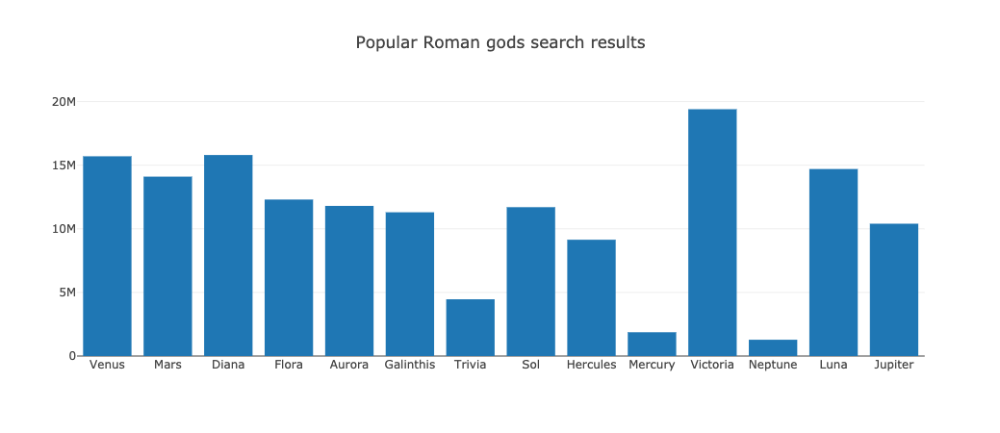

# Filtering with Plotly

In this activity, you will create an array of popular Roman god search results using the `filter` function with the [data.js](Unsolved/data.js) dataset.

## Instructions

1. Create a custom function to return Roman gods with more than 1 million search results.

2. Create an array of Roman god names from the filtered data.

3. Create an array of Roman god search results from the filtered data.

4. Create a Plotly bar chart with names on the x axis and search results on the y axis. For example:

**Hint:** Open the console to see the dataset stored in the variable `data`.

------

© 2021 Trilogy Education Services, a 2U, Inc. brand. All Rights Reserved.

