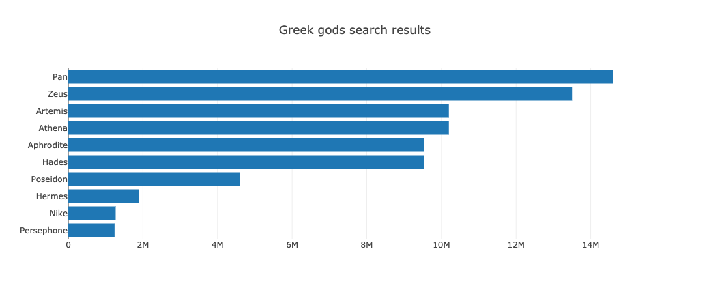

# Sorting and Slicing with Plotly

In this activity, you will sort, slice, and reverse the [data.js](Unsolved/data.js) dataset to build a horizontal bar chart of the top 10 Greek god search results.

## Instructions

1. Sort the data by Greek search results in descending order.

2. Slice the first 10 objects of the array for the plot.

3. Reverse the array to accomodate for Plotly's horizontal bar chart defaults.

4. Create a Plotly bar chart with names on the x axis and search results on the y axis. For example: 

**Hint:** See the [plotly documentation](https://plotly.com/javascript/) to research how to make a bar chart horizontal.

------

© 2021 Trilogy Education Services, a 2U, Inc. brand. All Rights Reserved.

